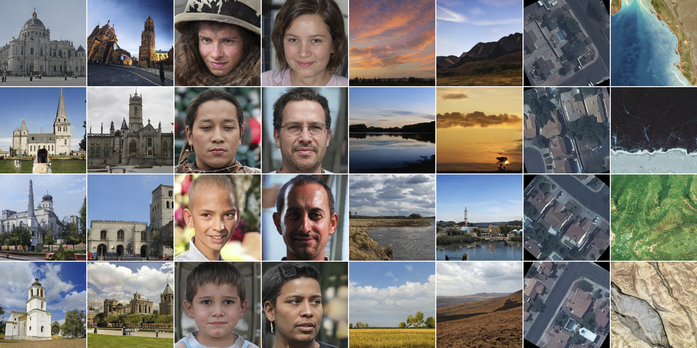
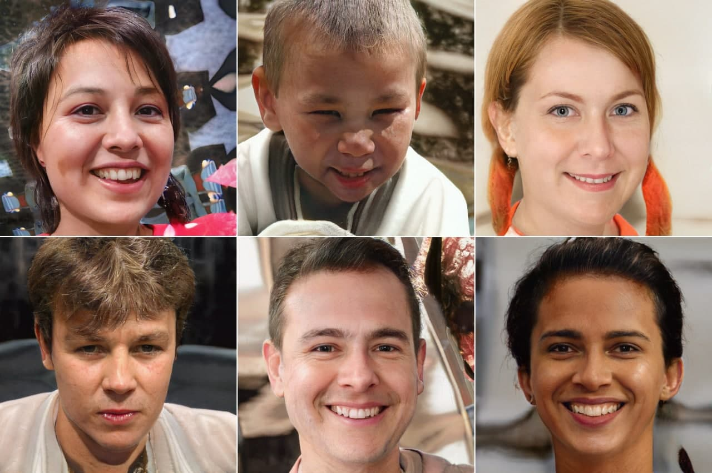

## CIPS -- Official Pytorch Implementation 

of the paper [Image Generators with Conditionally-Independent Pixel Synthesis](https://arxiv.org/abs/2011.13775)

[](https://paperswithcode.com/sota/image-generation-on-lsun-churches-256-x-256?p=image-generators-with-conditionally)



## Requirements

pip install -r requirements.txt

## Usage

First create lmdb datasets:

> python prepare_data.py images --out LMDB_PATH --n_worker N_WORKER --size SIZE1,SIZE2,SIZE3,... DATASET_PATH

This will convert images to jpeg and pre-resizes it. 

To train on FFHQ-256 or churches please run:

> python3 -m torch.distributed.launch --nproc_per_node=8 --master_port=1234 train.py --n_sample=8 --batch=4 --fid_batch=8 --Generator=CIPSskip --output_dir=skip-[ffhq/churches] --img2dis --num_workers=16 DATASET_PATH

To train on patches add --crop=PATCH_SIZE. PATCH_SIZE has to be a power of 2.

## Pretrained Checkpoints

[churches](https://drive.google.com/file/d/1lznTa52o2ZD7uKXkyZoUbL9wd8fj14wB/view?usp=sharing)

[ffhq256](https://drive.google.com/file/d/1JRd4ZpMDmlkbNlxnVvZx77Eyfac53KSq/view?usp=sharing)

[ffhq1024](https://drive.google.com/file/d/1vq4drXXnj_IDcYQGq_rrHIItiLXN0iOo/view?usp=sharing)

[landscapes](https://drive.google.com/file/d/1oCJAnL4A4GWYoIYSZVLVg2UQbRmeqdqV/view?usp=sharing)

### Generate samples

To play with the models please download checkpoints and check out a notebook.ipynb 

### Progressive training

We also tried to train  progressively on FFHQ starting from 256×256 initialization and got FID 10.07. We will update the paper with the training details soon. Checkpoint name is ffhq1024.pt. Samples are below.



## Citation
If you found our work useful, please don't forget to cite
```
@article{anokhin2020image,
  title={Image Generators with Conditionally-Independent Pixel Synthesis},
  author={Anokhin, Ivan and Demochkin, Kirill and Khakhulin, Taras and Sterkin, Gleb and Lempitsky, Victor and Korzhenkov, Denis},
  journal={arXiv preprint arXiv:2011.13775},
  year={2020}
}
```

The code is heavely based on the [styleganv2 pytorch implementation](https://github.com/rosinality/stylegan2-pytorch)

Nvidia-licensed CUDA kernels (fused_bias_act_kernel.cu, upfirdn2d_kernel.cu) is for non-commercial use only.